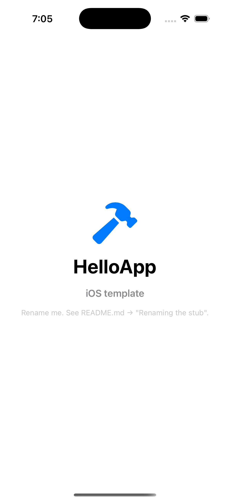
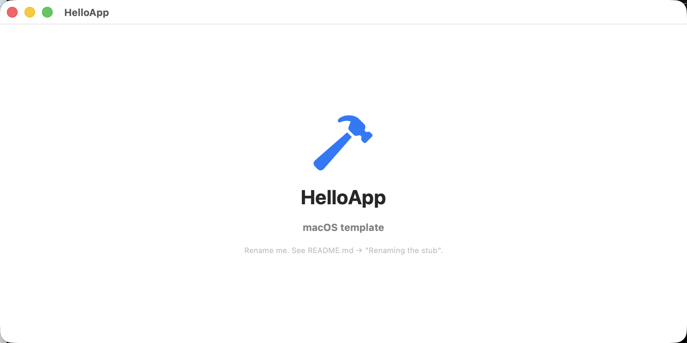

# Getting Started

> **Goal of this guide:** if you've never shipped an iOS or Mac app before, by the end of it you will have one running on your phone (or Mac) via TestFlight. About 30–60 minutes of focused time, $99/year for Apple Developer Program, and a Mac to build on (Xcode and the rest of Apple's build tools only run on macOS — you need a Mac even for an iPhone-only app).

<p align="center">
  
  &nbsp;&nbsp;
  
</p>

That's the starter app you'll customize into yours.

---

## What you'll learn to do

By the end of this guide:

1. You'll have **forked this template** into your own GitHub repo.
2. You'll have **customized the starter app** to your name + bundle ID.
3. You'll have **shipped a signed build to TestFlight** — Apple's official "beta testing" service.
4. You'll be able to **install your app on your iPhone or Mac** through the TestFlight app.
5. You'll have a release pipeline that re-runs every time you say `make ship` — no more "I forgot how to release" months later.

You will **not** be on the App Store yet — that's a separate Apple review step (covered briefly at the end). TestFlight is the staging ground; everyone uses it before going public.

---

## Vocabulary you'll see (skim this once)

| Term | Plain English |
|---|---|
| **Apple Developer Program** | Apple's paid membership ($99/year). Required to ship apps anywhere outside your own computer. Sign up at [developer.apple.com](https://developer.apple.com). |
| **App Store Connect** (ASC) | The website where you manage your apps, builds, screenshots, and TestFlight testers. Lives at [appstoreconnect.apple.com](https://appstoreconnect.apple.com). |
| **TestFlight** | Apple's beta-testing service. You upload a build here, and you (or invited testers) install it on real devices via the TestFlight app. Free. |
| **Bundle ID** | A unique identifier for your app, in reverse-domain form (e.g. `com.yourname.coolapp`). Once chosen, it's hard to change — pick something you'll keep. |
| **Code signing** | Apple cryptographically signs every app so iPhones know it's "really from you." Setting this up is the most painful part of shipping; this template hides 90% of the pain. |
| **Certificate** (cert) | The cryptographic identity Apple gives you. Lives in your Mac's Keychain. Limited to 3 distribution certs per developer team. |
| **Provisioning profile** | A document Apple generates that ties your cert + your bundle ID + the device(s) it can run on. The release tool auto-creates these for you. |
| **Xcode** | Apple's app — the IDE used to build iOS/Mac apps. Free, but a 15+ GB download. |
| **fastlane** | An open-source tool that automates the dozens of clicks Apple's UI normally requires for a release. The template uses it. |
| **CI** (continuous integration) | "When you push code, GitHub runs your tests/builds automatically." This template uses GitHub Actions. |
| **Repo / fork** | A GitHub repository (a project's home). To "fork" is to make your own copy you can change without affecting the original. |

You don't need to memorize these — refer back as you hit each.

---

## What you need before you start

### Hardware
- **A Mac.** Any Mac running macOS Sequoia (15) or newer. **Required even for iOS-only apps** — Xcode 26, xcodebuild, fastlane, and the iOS Simulator only run on macOS. There is no supported way to build iOS or Mac apps on Windows or Linux.
- **(Optional) An iPhone or iPad** to install your app via TestFlight at the end. Not strictly required — TestFlight also works on Mac.

### Money
- **$99 USD/year** for the Apple Developer Program. This is non-negotiable — Apple controls who can ship apps. Pay it once, you're set for a year.
- That's it. The template, GitHub, fastlane, and TestFlight itself are all free.

### Time
- **30–60 minutes** of focused time for the first ship. Most of it is waiting (Xcode install, Apple verification, etc.).
- **5 minutes** for every subsequent release.

### Patience for one specific thing
- **Apple Developer enrollment** sometimes requires a real-name verification step that takes 24–48 hours. If this hits you, plan for a 2-day setup window. Most enrollments go through in minutes.

---

## Step 1 — Install the developer tools (~15 minutes)

These are one-time installs. If you've done iOS/Mac development before, you may have most already.

```bash
# 1. Xcode (Apple's IDE — required for building anything Apple)
#    Open the Mac App Store, search "Xcode", install. ~15 GB download.
#    After install, open Xcode once to accept the license.

# 2. Xcode Command Line Tools (the underlying build tools)
xcode-select --install   # opens a system installer dialog; click Install

# 3. Homebrew (macOS package manager — installs everything else)
/bin/bash -c "$(curl -fsSL https://raw.githubusercontent.com/Homebrew/install/HEAD/install.sh)"

# 4. The GitHub CLI + git
brew install gh git

# 5. Authenticate gh (this opens your browser to log into GitHub)
gh auth login    # pick: GitHub.com → HTTPS → Yes (auth git) → browser
```

**Sanity check** — paste this and confirm each line shows a version number, not "command not found":

```bash
xcodebuild -version    # Xcode 26.x or higher
brew --version         # Homebrew 4.x or higher
gh --version           # gh version 2.x
git --version          # git version 2.x
```

If anything is missing, this template ships a one-shot checker — clone temporarily and run it:

```bash
git clone https://github.com/indiagrams/apple-shipkit.git /tmp/preflight \
  && bash /tmp/preflight/bin/preflight.sh \
  && rm -rf /tmp/preflight
```

It tells you exactly what's missing and how to install it.

> **Heads-up on Xcode quarantine.** If you installed Xcode via `xcodes-cli` or a manually downloaded `.xip`, it carries a `com.apple.quarantine` xattr that can block UI-test launches (and other dev-tool launches that pass through Gatekeeper). `make doctor` step 16 warns about this; `make screenshots` works around it automatically. The optional one-shot fix is `sudo xattr -dr com.apple.quarantine /Applications/Xcode.app`. App Store installs don't carry the bit.

---

## Step 2 — Sign up for Apple Developer Program ($99, ~5 minutes most cases)

1. Go to [developer.apple.com/programs/enroll](https://developer.apple.com/programs/enroll).
2. Sign in with the Apple ID you want to ship under. **This Apple ID is permanent** — apps you ship are tied to it. If you don't have one or want a separate "developer" Apple ID, create one first at [appleid.apple.com](https://appleid.apple.com).
3. Choose **Individual** (you, personally) or **Organization** (a registered LLC/Corp — needs a D-U-N-S number; skip unless you have one). Most highschoolers pick Individual.
4. Pay $99 USD via Apple Pay or credit card.
5. Wait for the confirmation email. Most accounts activate within minutes; a small percentage need 24–48 hours of human review.

Once active, you get access to two sites:
- **[developer.apple.com](https://developer.apple.com)** — for certificates, bundle IDs, devices.
- **[appstoreconnect.apple.com](https://appstoreconnect.apple.com)** — for TestFlight, App Store listings, screenshots.

Both use the same Apple ID.

---

## Step 3 — Find your Team ID (~2 minutes)

The Team ID is a 10-character string Apple uses to identify you. You'll need it shortly.

1. Go to [developer.apple.com/account](https://developer.apple.com/account).
2. Click **Membership details** (sidebar) — sometimes labeled **Membership**.
3. Find **Team ID**. Looks like `A1B2C3D4E5`. Copy it.

Save it somewhere — you'll paste it into a config file in Step 6.

---

## Step 4 — Create an App Store Connect API key (~5 minutes)

This is the credential that lets the release tool talk to App Store Connect on your behalf — so you don't have to log into Apple's website every time you ship.

1. Go to [appstoreconnect.apple.com/access/integrations/api](https://appstoreconnect.apple.com/access/integrations/api).
2. Click **+** to generate a key.
3. Name it `apple-shipkit` (any name works).
4. Access: **App Manager** (gives the key permission to upload builds + edit metadata).
5. Click **Generate**.
6. **Download the `.p8` file immediately** — Apple shows it ONCE. If you miss the download, you have to revoke the key and start over.
7. Note the **Key ID** (10 chars, like `ABC1234567`) and **Issuer ID** (UUID, like `12345678-abcd-...`).

Save the `.p8` file somewhere safe. A reasonable convention: `~/.config/secrets/AuthKey_<Key-ID>.p8` with `chmod 600`.

```bash
# Set up a tidy place for your secrets:
mkdir -p ~/.config/secrets
chmod 700 ~/.config/secrets
mv ~/Downloads/AuthKey_*.p8 ~/.config/secrets/
chmod 600 ~/.config/secrets/AuthKey_*.p8
```

---

## Step 5 — Fork this template (~1 minute)

```bash
# Pick a name for your repo (lowercase, hyphens):
gh repo create my-cool-app --template indiagrams/apple-shipkit --public --clone
cd my-cool-app
```

This creates `https://github.com/<your-username>/my-cool-app`, copies the template into it, and clones it locally.

> **Why public?** Public repos are free on GitHub. You can choose `--private` if you prefer; both work the same.

---

## Step 6 — Customize your app (~5 minutes)

The template ships with a starter app called **HelloApp**. Time to make it yours.

First, run the one-time dev-env setup. This installs the Ruby gems (fastlane et al.), Homebrew packages (xcodegen, lefthook, etc.), regenerates the Xcode project, and wires up the pre-push git hook. Takes ~30-90 seconds depending on what's already installed:

```bash
make bootstrap
```

Then scaffold a config file for the fork-bootstrap pipeline:

```bash
make init
```

This creates `.bootstrap.env` — open it in your editor and fill in the values:

```bash
$EDITOR .bootstrap.env
```

You'll see something like this. The fields marked `# fill in` are yours to set; the rest are sensible defaults or auto-filled by `make init` from your git remote:

```env
# What to call your app
APP_NAME=MyCoolApp                          # PascalCase, no spaces. Used as scheme + product name.
BUNDLE_ID=com.yourname.mycoolapp            # Reverse-domain. Must be globally unique.
DISPLAY_NAME='My Cool App'                  # The name iPhone users see under the icon.
APP_EMAIL=you@example.com                   # Your contact email. Required by App Store review.

# Pick your project generator (xcodegen is simpler; tuist is more flexible)
GENERATOR=xcodegen                          # xcodegen | tuist

# How releases run: ci = GitHub Actions builds + ships; local = your laptop ships
RELEASE_MODE=local                          # local is easier for first-time. Switch to ci later.

# Which platforms you ship: ios, macos, or both. Default 'ios,macos'.
PLATFORMS=ios,macos                         # 'ios' or 'macos' to ship just one

# Apple credentials (from Steps 3 + 4)
FASTLANE_TEAM_ID=A1B2C3D4E5                 # fill in — from Step 3
ASC_API_KEY_ID=ABC1234567                   # fill in — from Step 4 — Key ID
ASC_API_KEY_ISSUER_ID=12345678-abcd-...     # fill in — from Step 4 — Issuer ID
ASC_API_KEY_P8_PATH=~/.config/secrets/AuthKey_ABC1234567.p8  # fill in — from Step 4

# GitHub identity — auto-filled from `git remote get-url origin`. Override only
# if your fork lives somewhere other than github.com/<you>/<repo>.
GH_ORG=your-username                        # auto-filled by make init
GH_APP_REPO=my-cool-app                     # auto-filled by make init

# Optional design + ASC fields. Fill these in before running `make ship` for
# real (placeholder icon is fine for TestFlight; SKU/ASC name only matter once
# you've created the App Store Connect App record — see Step 7 below).
ICON_1024_PATH=                             # leave blank to use the placeholder hammer icon
ASC_APP_SKU=mycoolapp-001                   # any unique-to-you string
ASC_APP_NAME='My Cool App'                  # what shows on the App Store

# CI-mode only — leave blank for RELEASE_MODE=local. `make bootstrap-fork`
# generates a random 32-char password and writes it to this file if it
# doesn't exist yet, for when you switch to CI mode later. It locks the
# controlled keychain that release.yml mints fresh signing certs into
# per release run (then revokes them on workflow exit).
KEYCHAIN_PASSWORD_FILE=                     # ~/.config/secrets/keychain-password (CI mode only)
```

> **Pick BUNDLE_ID carefully.** It's the unique fingerprint of your app, and you can't change it later without losing your TestFlight history. If you own a domain, use it (`com.yourdomain.appname`). If you don't, `com.yourgithubusername.appname` is fine.

> **Why two modes?** `RELEASE_MODE=local` signs from your laptop using certs in your Keychain — easy first-run, no server config needed. `RELEASE_MODE=ci` runs the full pipeline on GitHub Actions when you run `make ship` (which dispatches `release.yml` via `gh workflow run`) — more setup, but it means anyone with repo write access can ship from any machine. Each CI release run mints its own short-lived signing certs into a controlled keychain and revokes them when the run ends, so there's no shared certs repo or PAT to manage. Start with `local`. You can switch later.

> **Why pick a platform subset?** If you're shipping an iPhone-only app and don't care about Mac, set `PLATFORMS=ios` — `make doctor` will stop probing for the Mac Installer cert, `make ship` skips the macOS .pkg build/upload, and CI on PRs runs fewer jobs (saving ~2-4 min/PR of macOS runner time). Same in reverse for `PLATFORMS=macos`. Switchable later: change the value, re-run `make bootstrap-fork`. **In CI mode, also re-run `bin/setup-github.sh`** — the required-checks list is set on first bootstrap and won't update automatically when you flip platforms.

> **Shipping more than one app from this template?** Cross-fork values like reviewer contact info, App Store URLs, copyright, ASC API key, and team ID are typically the *same* across every app you ship. Put them once in `~/code/.bootstrap.env` (gitignored, lives outside any clone); every fork's Makefile auto-sources it for `make doctor` / `bootstrap-fork` / `ship` / `verify` / `submit`. Per-fork values (`APP_NAME`, `BUNDLE_ID`, `DISPLAY_NAME`, `GH_APP_REPO`) stay in each clone's in-repo `.bootstrap.env` and always win when both files define a key.
>
> Cross-fork-eligible envs (each one optional; tracked file fallback always works):
>
> | Group | Envs | Notes |
> |---|---|---|
> | App Review contact | `APP_REVIEW_FIRST_NAME`, `APP_REVIEW_LAST_NAME`, `APP_REVIEW_EMAIL`, `APP_REVIEW_PHONE`, `APP_REVIEW_NOTES` | E.164 phone (`+14155551234`); placeholder `+10000000000` is fail-loud |
> | Demo account (apps with auth) | `APP_REVIEW_DEMO_USER`, `APP_REVIEW_DEMO_PASSWORD` | Required for any submission with a login wall |
> | App Store metadata | `ASC_PRIVACY_URL`, `ASC_SUPPORT_URL`, `ASC_MARKETING_URL`, `ASC_COPYRIGHT` | Doctor flags `example.com` URLs |
> | App Store locale + category | `ASC_PRIMARY_LOCALE` (default `en-US`), `ASC_PRIMARY_CATEGORY`, `ASC_SECONDARY_CATEGORY` | Locale drives `fastlane/metadata/<locale>/*.txt` |
> | TestFlight build-level | `ASC_USES_NON_EXEMPT_ENCRYPTION` (`true`/`false`) | HTTPS-only apps qualify for exempt (`false`); custom crypto = `true` + BIS registration |
> | TestFlight app-level | `BETA_APP_DESCRIPTION`, `BETA_APP_FEEDBACK_EMAIL`, `BETA_APP_MARKETING_URL`, `BETA_APP_PRIVACY_URL` | Privacy URL required for external testers |
> | App Privacy form ack | `ASC_APP_PRIVACY_ACK` (`true`) | Suppresses doctor's "App Privacy form unpublished" warning; fill the form once in the ASC web UI, then set this |
>
> Full schema in [`../.bootstrap.env.example`](../.bootstrap.env.example); each section has inline docs on storage, format, and when to set vs. leave blank.

---

## Step 7 — Verify everything is good (~30 seconds)

> **Before you run this:** Apple requires you to create the App Store Connect "App record" by hand once, before any tooling can upload a build. This is the one mandatory step the template can't automate (Apple's API forbids `POST /apps`).
>
> Go to [appstoreconnect.apple.com/apps](https://appstoreconnect.apple.com/apps), click **+ → New App**, fill in your **bundle ID** (matches `BUNDLE_ID` from Step 6) and **display name** (matches `DISPLAY_NAME`). Takes ~30 seconds. If you skip this, `make doctor` will fail at the `Verify ASC App record exists` step with a clear pointer back here.

```bash
make doctor
```

`make doctor` is read-only — it checks every prerequisite without changing anything. You'll see output like:

```
Bootstrap doctor
────────────────
  1. ✓ Apple credentials
  2. ✓ GitHub credentials
  3. ✓ GH_APP_REPO matches origin git remote
  ...
 14. ✓ App Store metadata text files
 15. ⚠ App Store screenshots
       No fastlane/screenshots/en-US/ — capture via `make screenshots` before App Store review (not TestFlight).
 16. ✓ Xcode.app quarantine xattr

Summary
───────
  ✓ 14 done    ⚠ 2 advisory

All bootstrap steps complete. Run `make ship` to trigger a release.
(Advisory items above are App-Store-review-only and don't block TestFlight.)
```

If you see `✗` (red) marks instead, doctor will tell you exactly what's missing and how to fix it.

> **Common first-time failures:**
> - Missing `.p8` file → re-check Step 4
> - Wrong Team ID → copy from Step 3 again
> - "ASC App record not found" → see the callout above; this is the manual ASC step.

When every step is `✓` or `⚠`, you're ready. (The pipeline runs 17 steps total; one of `Set 5 GH Secrets on app repo` (CI-only) or `Local keychain has signing identities` (local-only) swaps in based on your `RELEASE_MODE`, so the per-mode total is 17. With `PLATFORMS=ios` the macOS-only icon-regen step drops out, leaving 16.)

---

## Step 8 — Ship to TestFlight (~10 minutes)

```bash
make all
```

This runs the whole pipeline:

1. `make doctor` — re-verifies (idempotent)
2. `make bootstrap-fork` — sets up certs, registers the bundle ID, etc.
3. `make ship` — builds, signs, uploads, tags
4. `make verify` — polls App Store Connect until the build processes

You'll see ~5–10 minutes of build output. The release tool does roughly:

```
✓ Renaming HelloApp → MyCoolApp
✓ Generating Xcode project
✓ Provisioning iOS Distribution cert
✓ Provisioning Mac Installer Distribution cert
✓ Building iOS .ipa (5m)
✓ Building Mac .pkg (3m)
✓ Uploading both to TestFlight
✓ Tagging the commit v0.0.1+1
✓ Pushing the tag
```

If anything goes red, the tool stops and prints a real error message — no swallowed failures. See "When something goes wrong" below.

After upload, Apple takes 5–15 minutes to **process** the build before it's testable. `make verify` polls Apple until your build shows up as `state=VALID`. Output looks like:

```
Latest 4 builds for com.yourname.mycoolapp:
  ✓ 1 (0.0.1)  state=VALID  uploaded=2026-05-13T15:23:01Z
  ⏳ 1 (0.0.1)  state=PROCESSING  uploaded=2026-05-13T15:22:45Z

✅ Latest build 1 is processed and ready for TestFlight testers.
```

Both binaries `VALID` = you're done shipping. **You just shipped your first iOS + Mac app.**

---

## Step 9 — Install the app on your phone

1. Install the **TestFlight** app on your iPhone or iPad ([App Store link](https://apps.apple.com/app/testflight/id899247664)).
2. Sign in with the same Apple ID you used to enroll.
3. The TestFlight app shows your `My Cool App` under "Apps" because you're the developer.
4. Tap **Install**.
5. Open the app — it's running on your phone, signed by you, distributed by Apple.

For Mac: the same TestFlight app works on macOS Sequoia+ — install from the [Mac App Store](https://apps.apple.com/app/testflight/id899247664).

To invite friends to test: open [appstoreconnect.apple.com](https://appstoreconnect.apple.com) → your app → TestFlight tab → add their Apple IDs as Internal Testers (immediate, no review) or External Testers (requires Apple to approve your build first, takes 24h).

---

## What now?

You have a working app + working release pipeline. From here:

| Goal | What to do |
|---|---|
| Change the app's behavior | Edit files in `app/Shared/` (SwiftUI code, cross-platform). Run `make check` to verify it still builds. |
| Ship a new version | `make ship` again — versioning is automatic: tag `v<MARKETING>+<BUILD>` where `<MARKETING>` reads from `app/project.yml` (or `app/Project.swift` for Tuist) and `<BUILD>` resolves to `max(builds at marketing) + 1` from App Store Connect. |
| Replace the placeholder icon | Drop a 1024×1024 PNG into `app/iOS/Assets.xcassets/AppIcon.appiconset/Icon-1024.png`, run `make icons` to regenerate the macOS .icns, ship again. |
| Submit to the actual App Store | `make screenshots` (slow — review the PNGs), then `make submit`. Stages by default (review in App Store Connect web UI then click Submit yourself); flip `SUBMIT_FOR_REVIEW=true` in `.bootstrap.env` to auto-submit. Reads `PLATFORMS` so single-platform forks DTRT. See [MAINTAINING-A-FORK.md](MAINTAINING-A-FORK.md#i-want-to-submit-to-app-store-review) for the full ramp. |
| Move signing to GitHub Actions | Set `RELEASE_MODE=ci` in `.bootstrap.env`, follow the "Two release modes" section in [BOOTSTRAP.md](BOOTSTRAP.md#two-release-modes). |

---

## When something goes wrong

Most first-time failures fall into a few buckets. Here's what to do:

| Symptom | Likely cause | Fix |
|---|---|---|
| `make doctor` exits 2 with "missing 5 GH Secrets" | You set `RELEASE_MODE=ci` before configuring GH secrets | Either set `RELEASE_MODE=local` for now, or follow [BOOTSTRAP.md](BOOTSTRAP.md) to configure CI secrets |
| Signing fails with "Could not install WWDR certificate" during a CI release | Apple's intermediate cert isn't trusted on the runner before fresh certs are minted | The template's release.yml pre-installs WWDR before sigh provisions — see [CONTINUOUS-VALIDATION.md G4](CONTINUOUS-VALIDATION.md) |
| `altool` rejects with "ITMS-90296: app sandbox" on Mac | Xcode's Mac App Store profile strips `com.apple.security.app-sandbox` | The template's `local-release-check.sh` re-adds it automatically. If you see this, the script didn't run — file an issue with the full output |
| "Provisioning profile doesn't include the device" | You're trying to sideload, not TestFlight-distribute | TestFlight builds don't need device IDs in the profile. If you see this from `make ship`, your `RELEASE_MODE` may be misconfigured |
| `make doctor` says "ASC App record not found" | One-time human step — Apple's API forbids `POST /apps` | Go to [appstoreconnect.apple.com/apps](https://appstoreconnect.apple.com/apps), click + → New App, fill in your bundle ID + display name, then re-run `make doctor` |
| Apple rejects with "Account holder must accept Paid Apps Agreement" | Skip-able for free apps | If you're shipping a free app, no fix needed. If paid, log in to ASC → Agreements, Tax, and Banking → accept |
| `make screenshots` fails with "SmokeAppMacOSUITests-Runner is damaged and can't be opened" | Xcode carries `com.apple.quarantine` and the bit transitively propagates to UI-test runner bundles | The script handles this automatically (strips + ad-hoc re-signs the runner before launch). If you still see it, your Xcode install may be unusual — try `sudo xattr -dr com.apple.quarantine /Applications/Xcode.app` for a one-shot clear |
| Random `make ship` failure during CI mode | Check the latest entries in [CONTINUOUS-VALIDATION.md](CONTINUOUS-VALIDATION.md) — a multi-entry catalog of known shipping-pipeline gotchas |

If something isn't on this list, [open an issue](https://github.com/indiagrams/apple-shipkit/issues/new) with the full `make ship` output. The maintainers care; this template exists to absorb new gotchas as they're discovered.

---

## Going deeper

Once you're past the first ship, the [README's "Going deeper"](../README.md#going-deeper) section indexes every other doc — `.bootstrap.env` field reference, CI-mode setup, Tuist migration, no-CI mode, rollback procedures, and the full continuous-validation catalog.
